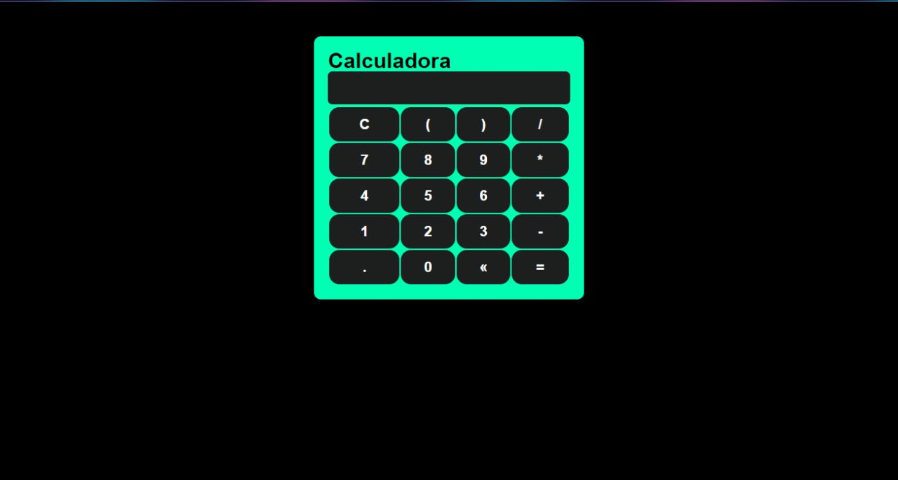

<h1 align="center">Calculadora</h1>
 
<h2>Deploy: <a href="https://paulo6581.github.io/calculadora/">Calculadora</a><h2>

    

## 🛠 Tecnologies:

The following tools were used in the construction of the project:

 <ul>
    <li>JavaScript</li>
    <li> API DOM</li>
    <li>Html</li>
    <li>Css</li>
 </ul>
